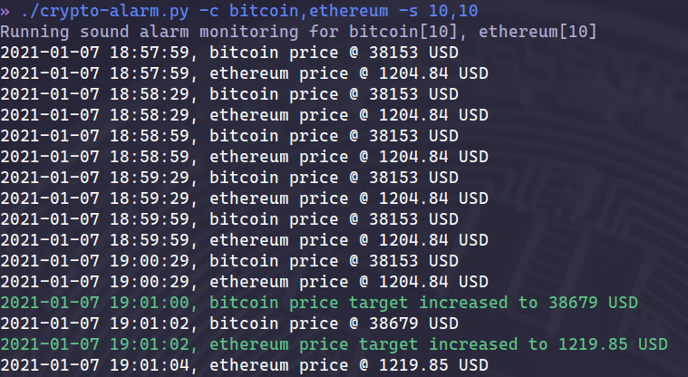

# crypto-alarm

A cross-platform python daemon to configure crypto sound alarms.



-- Powered by CoinGecko API

## Installation

Requires python 3.x and pip.

```shell
pip install -r requirements.txt
```

## Examples

Track price for bitcoin in the command line:

```shell
./crypto-alarm.py -c bitcoin -s 1000
```

Launch as a daemon to get audio alerts in the background:

```shell
./crypto-alarm.py -c bitcoin,ethereum -s 1000,100 -d
```

Kill the running daemon:

```shell
./crypto-alarm.py -k
```

Test the alarm sounds:

```shell
./crypto-alarm.py -t
```